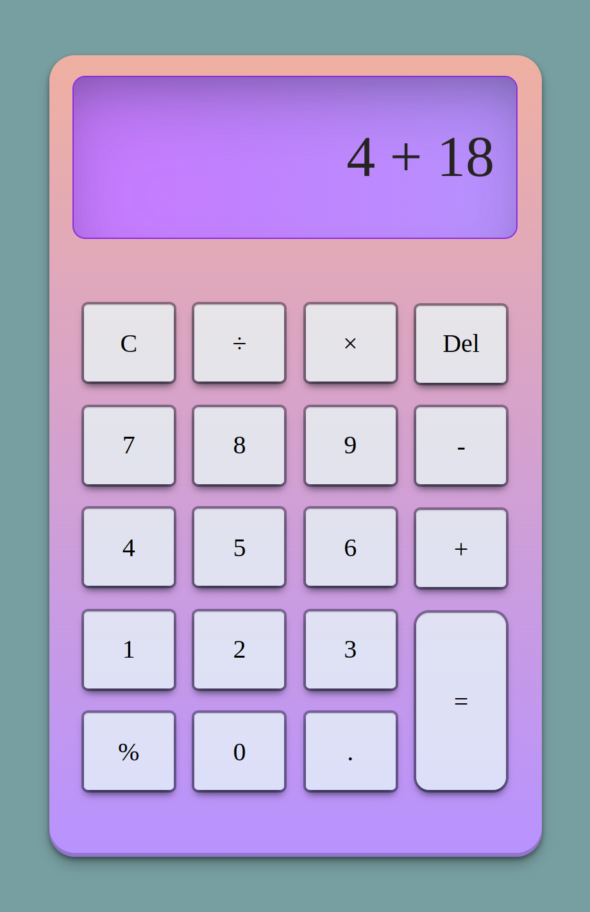

# Simple Calculator

### Description
A web based calculator application.

### Functionality
* Addition
* Subtraction
* Multiplication
* Division
* Modulo
* Deletion
* Clear All

### Code Base
* JavaScript
* HTML
* CSS

### Showcase 

